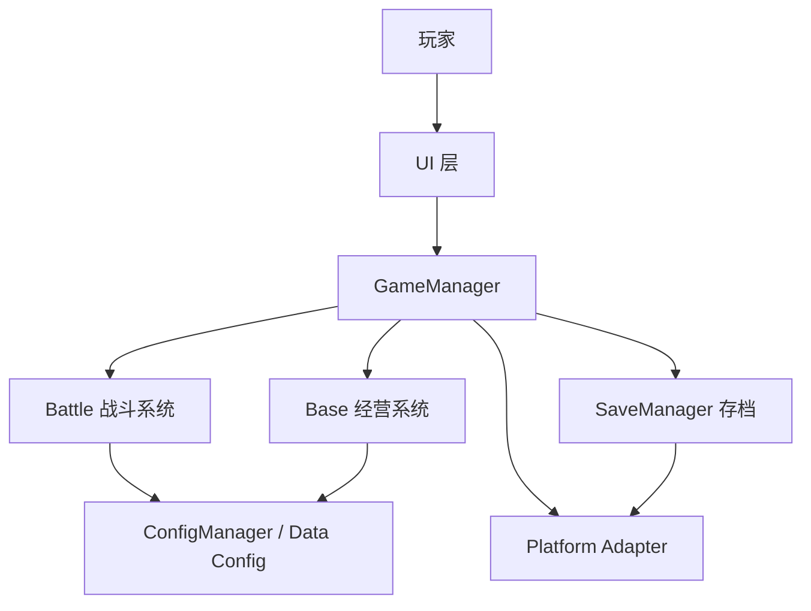
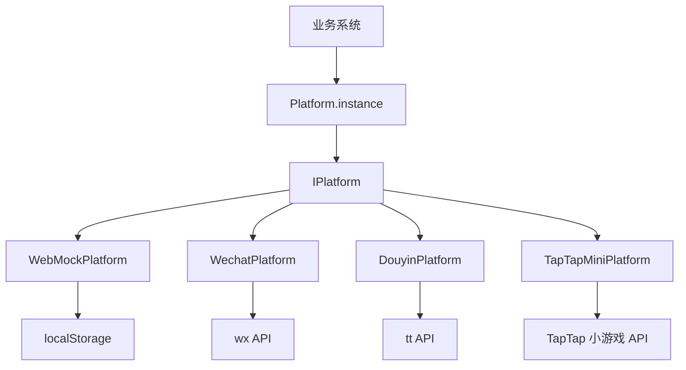
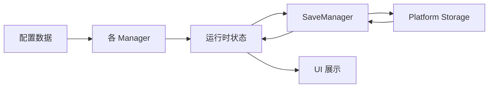

# 技术设计文档

## 1. 技术基线

- 引擎：Cocos Creator 3.8.x
- 语言：TypeScript
- 屏幕方向：竖屏
- 第一阶段平台：Web 预览、微信小游戏、抖音小游戏、TapTap 小游戏
- 第二阶段可选：TapTap Android APK

## 2. 总体系统结构图

```txt
玩家
-> UI 层
-> GameManager
-> Battle / Base / Data / Platform / Save
-> 配置、存档、本地平台能力
```



## 3. 核心循环结构图

```txt
BattleManager
-> BattleSettlement
-> ResourceManager / SaveManager
-> BuildingManager / TowerManager
-> IdleIncomeManager
-> RebirthManager
-> Permanent Skills
-> BattleManager
```

## 4. 模块结构图

```txt
assets/
└─ scripts/
   ├─ core/
   │  ├─ GameManager.ts
   │  ├─ SaveManager.ts
   │  ├─ EventBus.ts
   │  ├─ TimeManager.ts
   │  └─ ConfigManager.ts
   ├─ battle/
   │  ├─ BattleManager.ts
   │  ├─ StageManager.ts
   │  ├─ EnemySpawner.ts
   │  ├─ EnemyController.ts
   │  ├─ TowerManager.ts
   │  ├─ TowerController.ts
   │  ├─ ProjectileManager.ts
   │  ├─ SkillManager.ts
   │  ├─ RogueChoiceManager.ts
   │  └─ BattleSettlement.ts
   ├─ base/
   │  ├─ BaseManager.ts
   │  ├─ BuildingManager.ts
   │  ├─ IdleIncomeManager.ts
   │  └─ RebirthManager.ts
   ├─ data/
   │  ├─ TowerConfig.ts
   │  ├─ EnemyConfig.ts
   │  ├─ StageConfig.ts
   │  ├─ BuildingConfig.ts
   │  ├─ SkillConfig.ts
   │  ├─ RebirthConfig.ts
   │  └─ EconomyConfig.ts
   ├─ platform/
   │  ├─ IPlatform.ts
   │  ├─ Platform.ts
   │  ├─ WebMockPlatform.ts
   │  ├─ WechatPlatform.ts
   │  ├─ DouyinPlatform.ts
   │  └─ TapTapMiniPlatform.ts
   └─ ui/
      ├─ MainUI.ts
      ├─ BattleUI.ts
      ├─ SettlementUI.ts
      ├─ BuildingUI.ts
      ├─ TowerUpgradeUI.ts
      ├─ RebirthUI.ts
      └─ SettingsUI.ts
```

## 5. 平台适配结构图



平台 API 只能出现在 `assets/scripts/platform/`。

## 6. 启动流程

```txt
GameBootstrap.onLoad()
  → Platform.instance (WebMock)
  → ConfigManager.getInstance()
  → EventBus.getInstance()
  → TimeManager.getInstance()
  → BattleManager.getInstance()

GameBootstrap.start()
  → BattleManager.startBattleByIndex(0)
  → 自动放置测试塔
  → 战斗循环开始

GameBootstrap.update(deltaTime)
  → BattleManager.update(deltaTime)
  → 更新 UI
```

GameBootstrap 职责：

1. 初始化所有 Manager 单例
2. 启动第 1 关测试战斗
3. 自动放置测试塔
4. 输出调试日志
5. 更新 UI 显示

注意：

- GameBootstrap 只负责启动和连接系统
- 不把大量战斗逻辑塞进 GameBootstrap
- 不硬编码大量核心数值
- 不直接调用平台 API
- 不实现 007 之后的功能

## 7. 数据流图



## 8. 主要 Manager 划分

- `GameManager`：流程状态、模块初始化、主界面与战斗切换。
- `ConfigManager`：统一读取塔、敌人、关卡、建筑、技能、经济和重构配置。
- `SaveManager`：存档默认值、读写、版本迁移预留、离线时间戳。
- `TimeManager`：战斗计时、在线收益计时、离线时长计算。
- `BattleManager`：单局状态、开始、暂停、胜负、结算触发。
- `StageManager`：关卡配置读取和关卡进度。
- `EnemySpawner`：按波次生成敌人。
- `TowerManager`：固定塔位、塔实例、塔升级加成。
- `SkillManager`：主动技能次数和释放。
- `RogueChoiceManager`：局内 3 选 1 强化。
- `BuildingManager`：建筑等级、升级、效果汇总。
- `IdleIncomeManager`：在线收益、离线收益和上限。
- `RebirthManager`：星核重构条件、碎片计算、重置与保留。

## 9. 配置系统设计

MVP 至少包含：

- `TowerConfig`
- `EnemyConfig`
- `StageConfig`
- `BuildingConfig`
- `SkillConfig`
- `RebirthConfig`
- `EconomyConfig`

原则：

- 数值必须配置驱动。
- 业务逻辑不得散落大量魔法数字。
- MVP 可先用 TypeScript 常量，后续可迁移 JSON 或表格。
- 配置读取统一经过 `ConfigManager`。

## 10. 存档系统设计

MVP 存档字段：

```txt
playerLevel
currentStage
highestStage
battleCoin
baseCoin
rebirthToken
baseCoreLevel
labLevel
mineLevel
reactorLevel
factoryLevel
towerLevels
permanentSkillLevels
lastOfflineTimestamp
settings
```

规则：

- 缺字段时使用默认值。
- 读写失败时降级。
- Web 调试使用 `localStorage`。
- 小游戏平台使用 platform adapter 的 storage 能力。
- 第一阶段不接服务器。

## 11. 构建与包体原则

- 主包目标小于 4MB。
- 大资源预留分包和远程资源。
- 首屏资源保持精简。
- 不引入不必要大型依赖。
- 平台构建差异在平台适配层和构建配置中处理。
